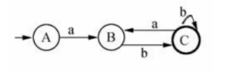

# 编译原理笔记

## 语法分析分类：

自顶向下：递归下降、LL(1) 等，核心是“推导”。

自底向上：移进—归约、算符优先、LR 分析等，核心是“归约”。

## 快速记忆
移进—归约 = 自底向上；推导 = 自顶向下。

复习软考时，看到“移进、归约、句柄、LR”这些词，基本都在“编译原理—语法分析—自底向上”这一块。

## 优先自动机

### DFA

A：初态，单圈，不是终态；

B：单圈，不是终态；

C：双圈，是终态。

a 是输入字符，不是状态。状态是 A、B、C。

字符串 abbbbbbbab 可以拆成：

a b b b b b b b a b

按该 DFA 的状态转移：

A —a→ B

B —b→ C （此时已读 ab）

C —b→ C （连续读多个 b，仍停在 C）

C —a→ B （读入 a，回到 B）

B —b→ C （再读入 b，回到终态 C）

最终停在终态 C，所以该字符串被这个 DFA 接受。

其中中间的 b 属于 (b|ab) 中的 b，所以符合该正则表达式，因此合法。

另外，DFA（确定的有限自动机）不允许空转移，也就是不能“不输入字符就跳状态”。

