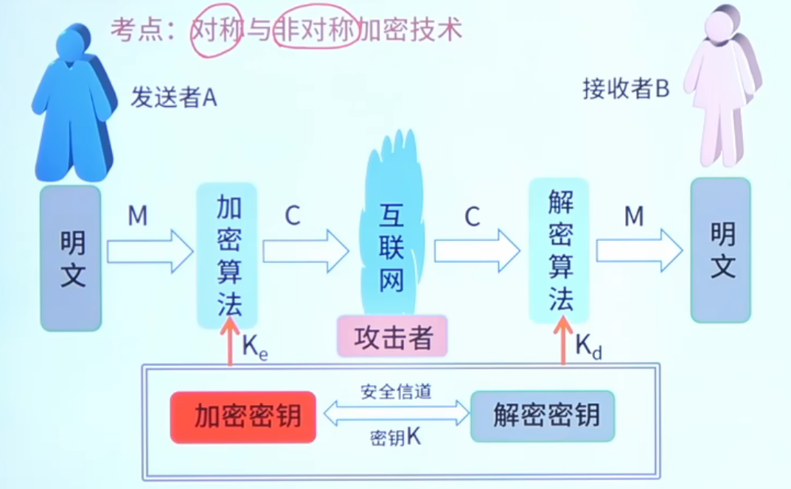
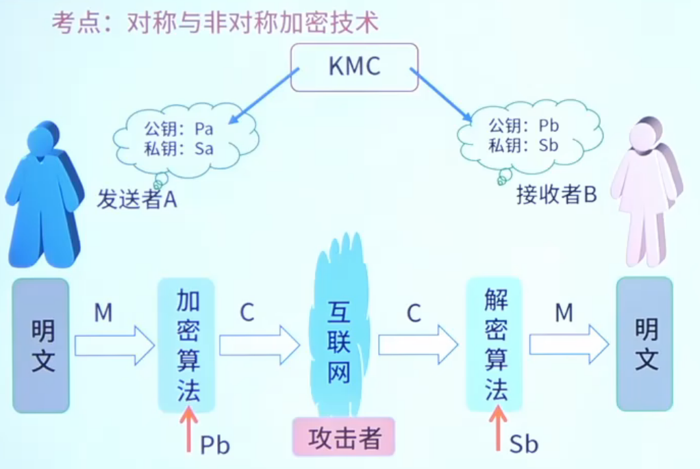

# 10.网络与信息安全基础知识

## 5.信息安全基础知识

### 对称加密 
加解密过程

$$ k_e = k_d $$
* 特点：加密速度快，安全性不高，时候大量文本时加密。
* 常见算法：AES、DES、3DES、RC-5、IDEA算法，记忆：后缀3S5I。

### 非对称加密
加解密过程

$$ k_e != k_d $$
* 特点：加密速度慢，安全性高，适合小量文本加密。
* 常见算法：RSA、DSA、ECC,记忆规律：AACC。

| 算法类型       | 算法                                          |
| -------------- | --------------------------------------------- |
| 对称加密算法   | 分组加密：AES、DES、3DES、IDEA , 流密码：RC-5 |
| 非对称加密算法 | RSA、DSA、ECC                                 |

